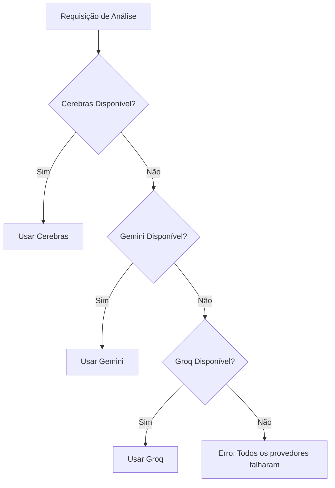
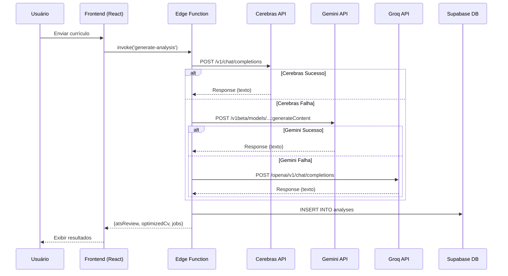

# Plano de Implementação: Cerebras como Provedor Primário de IA

## Objetivo
Substituir Groq por Cerebras como provedor primário de IA na Edge Function `generate-analysis`, mantendo Gemini como fallback secundário e Groq como terciário.

## Arquitetura de Fallback



## Configurações Necessárias

### 1. Secrets do Supabase
Adicionar às secrets do projeto:
```
CEREBRAS_API_KEY=<chave-da-api-cerebras>
```

### 2. Limites do Plano Gratuito Cerebras
| Métrica | Limite |
|---------|--------|
| Tokens/dia | 1.000.000 |
| Requests/hora | 7.200 |
| Contexto máximo | 64K tokens |

## Mudanças nos Arquivos

### Arquivo 1: `supabase/functions/generate-analysis/index.ts`

#### 2.1 Adicionar constante para Cerebras
```typescript
const CEREBRAS_API_KEY = Deno.env.get("CEREBRAS_API_KEY")
```

#### 2.2 Criar função `callCerebras`
```typescript
async function callCerebras(prompt: string, modelIndex = 0): Promise<string> {
  const models = ["llama-3.3-70b", "llama-3.1-70b", "llama-3.1-8b"]
  const model = models[modelIndex]

  for (let attempt = 0; attempt <= 3; attempt++) {
    const response = await fetch("https://api.cerebras.ai/v1/chat/completions", {
      method: "POST",
      headers: {
        "Content-Type": "application/json",
        Authorization: `Bearer ${CEREBRAS_API_KEY}`,
      },
      body: JSON.stringify({
        model,
        messages: [{ role: "user", content: prompt }],
        temperature: 0.7,
        max_tokens: 4000,
      }),
    })

    if (!response.ok) {
      const err = await response.json()
      const status = response.status
      // Rate limit ou erro de servidor = retry
      if ((status === 429 || status === 503 || status === 500) && attempt < 3) {
        await delay(Math.pow(2, attempt) * 1000)
        continue
      }
      // Tentar próximo modelo se disponível
      if (attempt >= 3 && modelIndex < models.length - 1) {
        return callCerebras(prompt, modelIndex + 1)
      }
      throw new Error(`Cerebras error ${status}: ${err?.error?.message}`)
    }

    const data = await response.json()
    const text = data?.choices?.[0]?.message?.content
    if (!text) throw new Error("Cerebras returned empty response")
    return text
  }
  throw new Error("Cerebras: max retries exceeded")
}
```

#### 2.3 Reordenar função `callAI`
```typescript
async function callAI(prompt: string): Promise<string> {
  const errors: string[] = []
  
  // 1. Tentar Cerebras primeiro (novo)
  if (CEREBRAS_API_KEY) {
    try {
      console.log("Attempting Cerebras API...")
      return await callCerebras(prompt)
    } catch (cerebrasErr) {
      const errMsg = cerebrasErr instanceof Error ? cerebrasErr.message : String(cerebrasErr)
      console.error("Cerebras failed, trying Gemini:", errMsg)
      errors.push(`Cerebras: ${errMsg}`)
    }
  }
  
  // 2. Gemini como fallback
  if (GEMINI_API_KEY) {
    try {
      console.log("Attempting Gemini API...")
      return await callGemini(prompt)
    } catch (geminiErr) {
      const errMsg = geminiErr instanceof Error ? geminiErr.message : String(geminiErr)
      console.error("Gemini failed, trying Groq:", errMsg)
      errors.push(`Gemini: ${errMsg}`)
    }
  }
  
  // 3. Groq como último recurso
  if (GROQ_API_KEY) {
    try {
      console.log("Attempting Groq API...")
      return await callGroq(prompt)
    } catch (groqErr) {
      const errMsg = groqErr instanceof Error ? groqErr.message : String(groqErr)
      console.error("Groq also failed:", errMsg)
      errors.push(`Groq: ${errMsg}`)
    }
  }
  
  throw new Error(`All AI providers failed: ${errors.join(" | ")}`)
}
```

## Passos de Implementação

| Ordem | Ação | Arquivo/Comando | Verificação |
|-------|------|-----------------|-------------|
| 1 | Criar conta em https://cerebras.ai/ | Navegador | Acesso ao dashboard |
| 2 | Gerar API Key no dashboard Cerebras | Cerebras Dashboard | Chave copiada |
| 3 | Adicionar secret ao Supabase | `npx supabase secrets set CEREBRAS_API_KEY=xxx` | Secret listada |
| 4 | Modificar Edge Function | `supabase/functions/generate-analysis/index.ts` | Código atualizado |
| 5 | Deploy da Edge Function | `npx supabase functions deploy generate-analysis` | Deploy bem-sucedido |
| 6 | Testar análise no app | Interface do usuário | Análise completa com sucesso |

## Diagrama de Fluxo de Dados



## Verificação de Implementação (DoD)

- [ ] Conta Cerebras criada e API key gerada
- [ ] Secret `CEREBRAS_API_KEY` configurada no Supabase
- [ ] Função `callCerebras()` implementada com retry logic
- [ ] Ordem de prioridade: Cerebras → Gemini → Groq
- [ ] Deploy da Edge Function realizado com sucesso
- [ ] Teste de análise completo funcionando
- [ ] Logs mostrando "Attempting Cerebras API..." em caso de sucesso
- [ ] Fallback para Gemini/Groq funcionando quando Cerebras falha

## Considerações de Performance

| Provedor | Latência Típica | Throughput | Estabilidade |
|----------|-----------------|------------|--------------|
| Cerebras | ~2-5s | 2000+ tokens/s | ⭐⭐⭐⭐⭐ |
| Gemini | ~3-8s | Variável | ⭐⭐⭐⭐ |
| Groq | ~1-3s | Muito alta | ⭐⭐⭐ |

**Nota:** Cerebras pode ter latência ligeiramente maior que Groq, mas oferece maior estabilidade e quota diária generosa (1M tokens).