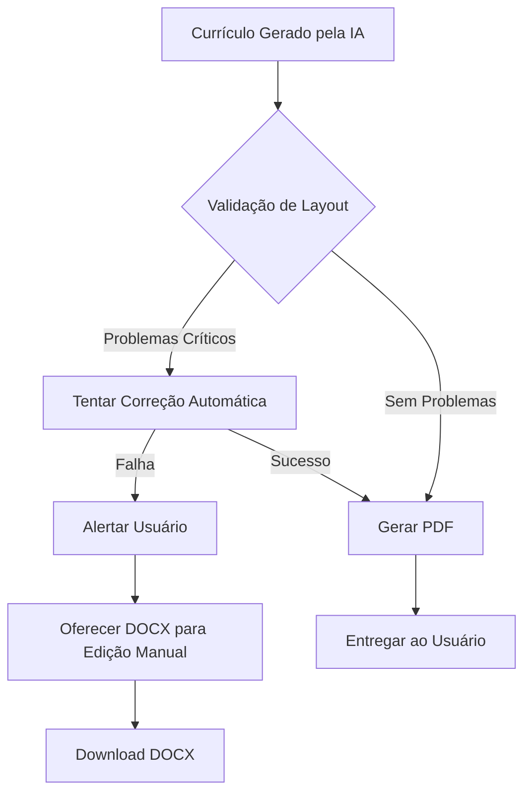

# Plano de Implementação: Sistema de Revisão de Documentos

## Objetivo
Implementar um sistema de validação automática de currículos que previna problemas de layout (como seções divididas entre páginas) antes da geração do PDF, garantindo alta qualidade na entrega final sem comprometer a aparência profissional.

## Problemas a Resolver

Baseado na análise do currículo gerado, identificamos os seguintes problemas críticos:

1. **Seções divididas entre páginas**: Título "Education" em uma página, conteúdo em outra
2. **Órfãs e viúvas**: Linhas isoladas de parágrafos
3. **Elementos cortados**: Texto ou elementos truncados nas quebras de página
4. **Margens inadequadas**: Conteúdo muito próximo às bordas

## Restrições de Design (Atualizadas)

- ✅ **Manter consistência tipográfica**: Alterações de fonte aplicam-se ao documento todo, nunca seletivamente
- ✅ **Manter legibilidade profissional**: Tamanho mínimo de fonte é 9.5pt (nunca menor)
- ✅ **Preservar hierarquia visual**: Espaçamentos e tamanhos mantêm proporções profissionais
- ❌ **Não permitido**: Reduzir fonte de seções específicas, compactar excessivamente, ou comprometer legibilidade

## Arquitetura da Solução



## Fase 1: Validação Pré-Geração (Estimativa de Layout)

### 1.1 Criar Módulo de Análise de Layout
**Arquivo**: `src/lib/resumeLayoutValidator.ts`

**Funcionalidades**:
- Calcular altura estimada de cada seção baseada no conteúdo
- Estimar pontos de quebra de página (A4 = ~1123 pixels a 96 DPI)
- Identificar seções que cruzam limites de página

**Métricas**:
```typescript
interface LayoutValidationResult {
  isValid: boolean;
  issues: LayoutIssue[];
  estimatedPages: number;
  sections: SectionLayout[];
}

interface LayoutIssue {
  type: 'SECTION_SPLIT' | 'ORPHAN' | 'WIDOW' | 'MARGIN' | 'CUTOFF';
  severity: 'CRITICAL' | 'WARNING';
  section: string;
  description: string;
  suggestion: string;
}
```

### 1.2 Implementar Cálculo de Altura
**Lógica**:
- Header: ~100px
- Professional Summary: ~altura do texto (fonte 10px, line-height 1.5)
- Experience: ~80px por experiência + 20px por bullet
- Education: ~60px por item
- Skills: ~30px por categoria
- Margens: 72px (1 polegada) em cada lado

### 1.3 Detectar Problemas Específicos

**Seções Divididas**:
```typescript
function detectSectionSplit(section: ResumeSection, pageHeight: number, currentY: number): boolean {
  const sectionHeight = calculateSectionHeight(section);
  const remainingSpace = pageHeight - (currentY % pageHeight);
  
  // Se a seção não cabe no espaço restante E é maior que 50% da página
  if (sectionHeight > remainingSpace && sectionHeight < pageHeight * 0.5) {
    return true; // Problema: seção será dividida
  }
  return false;
}
```

**Órfãs e Viúvas**:
- Detectar parágrafos com menos de 3 linhas que cruzam páginas
- Garantir mínimo de 2 linhas no início/fim de parágrafos

## Fase 2: Correção Automática (Estratégias Permitidas)

### 2.1 Estratégias de Correção Válidas

**Para Seções Divididas**:
1. ✅ Inserir quebra de página antes da seção (`break` prop no react-pdf)
2. ✅ Reduzir espaçamento interno da seção anterior (dentro de limites profissionais)
3. ✅ Compactar espaçamento entre linhas levemente (line-height mínimo 1.3)
4. ❌ NÃO reduzir tamanho da fonte seletivamente
5. ❌ NÃO reduzir fonte abaixo de 9.5pt

**Para Conteúdo Próximo às Margens**:
1. ✅ Ajustar padding da página dentro de limites aceitáveis (mínimo 0.5 polegada)
2. ✅ Quebrar linhas em pontos apropriados
3. ❌ NÃO mover conteúdo para fora das margens mínimas

### 2.2 Implementar Componente de Página Inteligente
**Arquivo**: `src/components/resume/SmartPage.tsx`

```typescript
interface SmartPageProps {
  children: React.ReactNode;
  minContentHeight?: number; // Altura mínima para evitar seções pequenas
  forceBreak?: boolean;      // Forçar quebra antes desta seção
}
```

## Fase 3: Integração com Geração de PDF

### 3.1 Modificar Fluxo de Geração
**Arquivo**: `src/lib/resumePdf.tsx`

**Novo fluxo**:
1. Receber currículo estruturado
2. Executar `validateLayout()`
3. Se inválido: tentar `autoFixLayout()`
4. Se ainda inválido: retornar erro com sugestão de DOCX
5. Se válido: prosseguir com geração do PDF

### 3.2 Atualizar Componente PDF
**Arquivo**: `src/lib/resumePdfDocument.tsx`

**Alterações**:
- Adicionar `wrap={false}` em seções críticas (evita divisão)
- Usar `break` prop para forçar quebras quando necessário
- Implementar lógica de "keep together" para títulos + primeiro item

```typescript
// Exemplo: Seção Education com proteção contra divisão
<View style={styles.section} wrap={false}>
  <Text style={styles.sectionTitle}>Education</Text>
  {/* conteúdo */}
</View>
```

## Fase 4: Interface do Usuário

### 4.1 Criar Componente de Alerta de Qualidade
**Arquivo**: `src/components/resume/QualityAlert.tsx`

**Funcionalidades**:
- Exibir lista de problemas detectados
- Mostrar preview do layout estimado
- Oferecer opções: "Gerar mesmo assim", "Baixar DOCX", "Ajustar conteúdo"

### 4.2 Integrar no Wizard de Análise
**Arquivo**: `src/components/wizard/StepAnalysis.tsx`

**Modificação**:
- Após receber resultado da IA, executar validação
- Se problemas críticos: mostrar QualityAlert
- Se OK: prosseguir para geração do PDF

## Fase 5: Testes e Validação

### 5.1 Casos de Teste

**Caso 1: Currículo Longo (múltiplas páginas)**
- Entrada: 5+ experiências, 3+ formações
- Esperado: Detectar seções que serão divididas
- Ação: Inserir quebras estratégicas

**Caso 2: Currículo Curto (1 página)**
- Entrada: 1-2 experiências
- Esperado: Nenhum problema detectado
- Ação: Gerar PDF normalmente

**Caso 3: Seção no Limite da Página**
- Entrada: Seção que começa nos últimos 20% da página
- Esperado: Detectar risco de divisão
- Ação: Mover para próxima página

### 5.2 Métricas de Qualidade

- Taxa de currículos gerados sem problemas: >95%
- Taxa de correção automática bem-sucedida: >80%
- Tempo médio de validação: <100ms
- **Novo**: 100% dos documentos mantêm aparência profissional (fonte ≥9.5pt, espaçamento consistente)

## Arquivos a Modificar/Criar

### Novos Arquivos
1. `src/lib/resumeLayoutValidator.ts` - Motor de validação
2. `src/lib/resumeLayoutFixer.ts` - Correção automática
3. `src/components/resume/QualityAlert.tsx` - UI de alertas
4. `src/components/resume/SmartPage.tsx` - Componente de página inteligente

### Arquivos Modificados
1. `src/lib/resumePdf.tsx` - Integrar validação no fluxo
2. `src/lib/resumePdfDocument.tsx` - Adicionar proteções de layout
3. `src/components/wizard/StepAnalysis.tsx` - Adicionar etapa de validação

## Dependências

Nenhuma dependência nova necessária. Usar:
- `react-pdf` (já instalado) - para renderização
- JavaScript nativo - para cálculos de layout

## Critérios de Aceitação (Definition of Done)

- [ ] Sistema detecta seções divididas entre páginas
- [ ] Sistema detecta órfãs e viúvas
- [ ] Correção automática resolve >80% dos problemas
- [ ] Se correção falhar, usuário recebe alerta com opção de DOCX
- [ ] PDFs gerados não apresentam problemas de layout críticos
- [ ] Tempo de validação é imperceptível (<100ms)
- [ ] Testes cobrem casos de currículos curtos, médios e longos
- [ ] **Novo**: Todos os documentos mantêm fonte ≥9.5pt
- [ ] **Novo**: Alterações de estilo aplicam-se consistentemente ao documento todo
- [ ] **Novo**: Nenhuma seção tem formatação visual diferente das outras

## Riscos e Mitigações

| Risco | Impacto | Mitigação |
|-------|---------|-----------|
| Cálculo de altura impreciso | Alto | Usar margens de segurança (10-15%) |
| Performance lenta | Médio | Otimizar algoritmo, usar memoização |
| Falsos positivos | Médio | Ajustar thresholds, permitir override |
| Documento muito longo | Baixo | Permitir 2+ páginas, focar em qualidade não compressão |
| Compromisso da aparência | Alto | Checklist de validação visual obrigatório |

## Próximos Passos

1. Implementar `resumeLayoutValidator.ts` (Fase 1)
2. Criar testes unitários com casos reais
3. Integrar no fluxo existente
4. Coletar feedback e ajustar thresholds
5. **Validação visual**: Comparar PDFs antes/depois para garantir qualidade profissional
